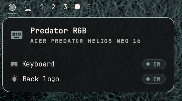
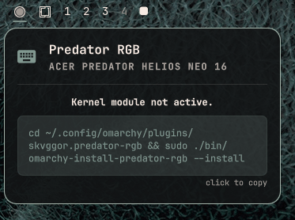

# Predator RGB · Omarchy



[](https://youtube.com/shorts/nR_2H0sh1xg)

An Omarchy plugin that keeps the **Acer Predator Helios Neo 16** keyboard backlight and rear lid logo in sync with the active Omarchy theme. Every time you switch themes, the LEDs switch to the theme's **accent color** at 100% brightness.

## How it works

1. On every theme change, Omarchy writes the theme accent hex to `~/.local/state/omarchy/current/theme/keyboard.rgb`.
2. The installed `theme-set.d` hook (`theme-set`) reads that hex and drives the `acer_rgb` kernel module via sysfs.
3. A bar widget shows the current theme + accent and LED status.

## Supported LEDs

- **Keyboard**: 4-zone RGB backlight, all zones set to the theme accent.
- **Rear lid logo**: switched on/off and colored via WMI.

## Requirements

- Omarchy with the template/hook system
- Acer Predator Helios Neo 16 **PHN16-72** (kernel module DMI match)
- **Kernel headers** (`sudo pacman -S linux-headers`)

## Install

### 1. Install the plugin

```sh
omarchy plugin add git@github.com:skvggor/predator-rgb-omarchy-plugin.git --enable
```

### 2. Install the kernel module

Open the panel from the bar icon and click to copy the install command:



Then run it in your terminal:

```sh
cd ~/.config/omarchy/plugins/skvggor.predator-rgb && sudo ./bin/omarchy-install-predator-rgb --install
```

You will be asked for your password. The script builds and installs the `acer_rgb` kernel module, loads it, sets up udev rules, and restarts the shell automatically.

The keyboard LED now follows the active Omarchy theme automatically.

## Usage

Theme changes sync automatically. The bar icon opens a panel showing the current theme, accent color, and LED status.

## Uninstall

### 1. Remove the kernel module

```sh
cd ~/.config/omarchy/plugins/skvggor.predator-rgb
sudo ./bin/omarchy-install-predator-rgb --uninstall
```

### 2. Remove the plugin

```sh
omarchy plugin remove skvggor.predator-rgb
```

## Manual commands

Run from the plugin directory (`~/.config/omarchy/plugins/skvggor.predator-rgb`):

| Command | Description |
|---------|-------------|
| `sudo ./bin/omarchy-install-predator-rgb --install` | Build, install, and load the kernel module |
| `sudo ./bin/omarchy-install-predator-rgb --uninstall` | Unload and remove the kernel module |
| `sudo ./bin/omarchy-install-predator-rgb --load` | Load the kernel module (if already installed) |
| `sudo ./bin/omarchy-install-predator-rgb --unload` | Unload the kernel module (keeps it installed) |
| `./bin/omarchy-install-predator-rgb --check` | Check if kernel headers are available |

## Files

| File | Purpose |
|------|---------|
| `manifest.json` | Omarchy plugin manifest (bar widget) |
| `Panel.qml` | Bar widget UI (status display) |
| `BarWidget.qml` | Bar icon and tooltip |
| `Service.qml` | Plugin state detection and apply logic |
| `LedIndicator.qml` | LED status indicator component |
| `Model.js` | Pure JS helpers: hex parsing |
| `theme-set` | Reads accent hex and writes to acer_rgb sysfs |
| `bin/omarchy-install-predator-rgb` | Kernel module install/uninstall script |
| `kernel-module/src/acer_rgb.c` | Kernel module: WMI control of 4-zone keyboard + back logo |

## Development

```sh
npm test                 # Model.js unit tests
omarchy plugin validate . # manifest schema check
```

## License

GNU General Public License v3.0.
