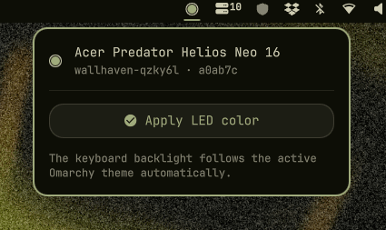

# Predator RGB · Omarchy



[](https://youtube.com/shorts/nR_2H0sh1xg)

An Omarchy plugin that keeps the **Acer Predator Helios Neo 16** keyboard backlight and rear lid logo in sync with the active Omarchy theme. Every time you switch themes, the LEDs switch to the theme's **accent color** at **100% brightness** (configurable).

## How it works

Omarchy already ships `omarchy-theme-set-keyboard`, but it only covers ASUS ROG and Framework 16, not the Acer Predator. This plugin fills that gap.

1. On every theme change, Omarchy writes the theme accent hex to `~/.local/state/omarchy/current/theme/keyboard.rgb`.
2. The installed `theme-set.d` hook (`theme-set`) reads that hex and drives the `acer_rgb` kernel module:
   - Writes to `/sys/devices/platform/acer_rgb/four_zoned_kb/per_zone_mode`
   - All 4 zones set to the same color at full brightness; also writes `/sys/devices/platform/acer_rgb/four_zoned_kb/back_logo`
3. A bar widget shows the current theme + accent and status.

```
omarchy theme set <theme>
      │
      ▼
~/.local/state/omarchy/current/theme/keyboard.rgb   (#819890)
      │
      ▼
theme-set hook  (hex → per-zone + back-logo sysfs write)
      │
      ▼
/sys/devices/platform/acer_rgb/four_zoned_kb/per_zone_mode
/sys/devices/platform/acer_rgb/four_zoned_kb/back_logo
```

The sysfs interface is accessible to users in the `acer_rgb` group, so **no root is required** at theme-change time. The hook exits silently when the module isn't loaded.

## Supported LEDs

- **Keyboard** — 4-zone RGB backlight, all zones set to the theme accent via WMI method `0x06` (zone color) + `0x14` (mode/brightness) under GUID `7A4DDFE7-5B5D-40B4-8595-4408E0CC7F56`.
- **Rear lid logo** — switched on/off and colored via WMI method `0x0C` (RGB + brightness + enable) + `0x14` power gate. Controlled with the `backLogoEnabled` setting.

## Requirements

- Omarchy with the template/hook system
- Acer Predator Helios Neo 16 **PHN16-72** (kernel module DMI match)
- **Kernel headers** (will be installed automatically if missing)

## Install

### Option A: Omarchy plugin add (recommended)

```sh
omarchy plugin add git@github.com:skvggor/predator-rgb-omarchy-plugin.git
```

Then run the setup script to install the kernel module and configure permissions:

```sh
cd ~/.config/omarchy/plugins/skvggor.predator-rgb
./install.sh
```

The install script will automatically:
- Install `linux-headers` if missing
- Build and install the kernel module
- Create the `acer_rgb` group
- Configure udev rules for permissions
- Enable the plugin

A polkit popup will ask for your password (no terminal required).

### Option B: One-liner from GitHub

```sh
curl -fsSL https://raw.githubusercontent.com/skvggor/predator-rgb-omarchy-plugin/main/bootstrap.sh -o /tmp/predator-rgb-bootstrap.sh
bash /tmp/predator-rgb-bootstrap.sh
```

### Option C: Clone + install

```sh
git clone git@github.com:skvggor/predator-rgb-omarchy-plugin.git
cd predator-rgb-omarchy-plugin
./install.sh
```

## Install command

The `bin/omarchy-install-predator-rgb` command follows the Omarchy dual-path pattern:

```sh
bin/omarchy-install-predator-rgb --check      # Verify kernel headers (no root)
bin/omarchy-install-predator-rgb --install    # Build + install module (needs root)
bin/omarchy-install-predator-rgb --uninstall  # Remove module (needs root)
```

When run from a terminal, uses `sudo`. When run from the shell (no terminal), uses `pkexec` with the Omarchy polkit popup.

## Usage

Theme changes sync automatically. The bar icon opens a panel showing the current theme, accent color, and LED status.

### Settings

| Key | Type | Default | Meaning |
|-----|------|---------|---------|
| `brightness` | integer | `100` | Static LED brightness (0-100) |
| `backLogoEnabled` | boolean | `true` | Turn the rear lid logo on (colored like the keyboard) or off |

Set via `omarchy bar set skvggor.predator-rgb brightness 80` or the shell settings UI.

## Files

| File | Purpose |
|------|---------|
| `theme-set` | Hook + CLI: reads accent hex and writes to acer_rgb sysfs |
| `manifest.json` | Omarchy plugin manifest (bar widget) |
| `Panel.qml` | Bar widget UI |
| `Service.qml` | Plugin state, refresh, and apply logic |
| `Model.js` | Pure JS helpers: hex parsing |
| `bin/omarchy-install-predator-rgb` | Privileged install/uninstall with polkit support |
| `install.sh` / `uninstall.sh` | User-space wrappers |
| `kernel-module/src/acer_rgb.c` | Kernel module: WMI control of 4-zone keyboard + back logo |

## Development

```sh
npm test                 # Model.js unit tests
omarchy plugin validate . # manifest schema check
```

For linting (optional, development only):

```sh
npm install -g eslint @eslint/js
eslint .
```

## Uninstall

```sh
./uninstall.sh           # removes module + hook + disables widget
./uninstall.sh --purge   # also deletes the copied plugin files
```

## License

GNU General Public License v3.0.
